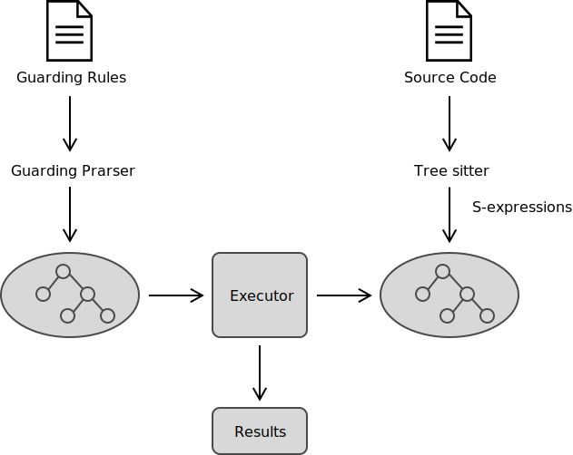

# Guarding

[](https://github.com/inherd/guarding/actions/workflows/build.yml)
[](https://crates.io/crates/guarding)
[](https://docs.rs/guarding/)
[](https://github.com/inherd/guarding/blob/master/LICENSE)

> Guarding is a guardians for code, architecture, layered. Using git hooks and DSL for design guard rules.

Inspired by [ArchUnit](https://github.com/TNG/ArchUnit)



## Usage

### use CLI

1. install

```
cargo install guarding
```

2. create `guarding.guarding` file

```
package(".")::file.len should < 200;
package(".")::file.len should > 50;
```

3. run 

```
guarding .
```

### use API

- `guarding_adapter`, FFI adapter, provide Guarding api,
- `guarding_core`, core guarding model,
- `guarding_ident`, identify different language: Java, JavaScript, Rust
- `guarding_parser` parsing Guarding DSL

## Development

workflow:

1. parsing guarding rules
2. parsing source code to models
3. capture rule with models

DSL capture logic:

1. filter models from `rule_level` with `rule_scope`
2. run expression
3. run assert

Queries Samples: [https://github.com/nvim-treesitter/nvim-treesitter/tree/master/queries](https://github.com/nvim-treesitter/nvim-treesitter/tree/master/queries)

### Guarding - Class or Struct function-name

for packages:

```
class(implementation "BaseParser")::name should endsWith "Parser";

class("java.util.Map") only accessed(["com.phodal.pepper.refactor.staticclass"]);
class(implementation "BaseParser")::name should not contains "Lexer";
```

for Java, JavaScript

```
# 类::名 包含 "Controller";
# 中文分词：("..myapp..") 类名称中包含 "Controller"
class("..myapp..")::function.name should contains("Model");
# or
class("..myapp..")::function.name contains("");
```

for Rust and Golang

```
struct("..myapp..")::function.name should contains("Model");
# or
struct("..myapp..")::function.name contains("");
```

License
---

This code is distributed under the MIT license. See `LICENSE` in this directory.

